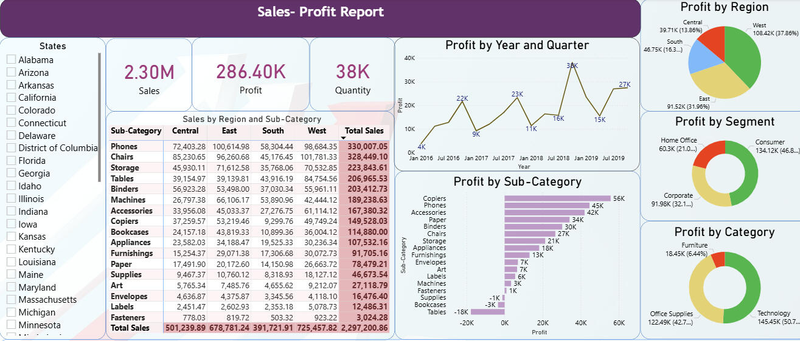

# Sales & Profit Visualization Dashboard - Power BI

A comprehensive interactive Power BI dashboard for analyzing U.S. Superstore sales and profitability metrics from 2016-2019. Identify profit drivers, loss areas, and performance trends across regions, customer segments, product categories, and time periods.

> **For a detailed explanation and more visualizations**, visit my [Portfolio](https://kavyashreebn-en.carrd.co/#vis)

## ✨ Features

- **Regional Analysis**: Profit distribution across U.S. regions and states
- **Customer Segmentation**: Performance breakdown by Consumer, Corporate, and Home Office segments
- **Product Analysis**: Category and sub-category profitability rankings
- **Time Series Analysis**: Year-over-year and quarterly trends
- **KPI Cards**: Summary metrics for Sales, Profit, Quantity, and Margin
- **Interactive Slicers**: Dynamic filtering by state, region, segment, category, and time period
- **Drill-down & Cross-filtering**: Navigate to details and cross-filter all visuals 



## 📊 Dataset

- **Records**: ~9,994 transactions from 2016-2019
- **Fields**: Order/Ship dates, Region, State, City, Customer segments, Product categories, Sales, Profit, Discount, Quantity
- **Source**: Kaggle (U.S. Superstore-style dataset)
- **Currency**: USD

## 🚀 Installation & Setup

### Requirements
- **Power BI Desktop** (Free from [Microsoft](https://powerbi.microsoft.com/desktop/))
- Windows 10/11 or Windows Server 2016+
- 2 GB RAM minimum (4 GB recommended)

### Steps
1. Download and install Power BI Desktop
2. Clone or download this repository
3. Open `Visualization_Master Task.pbix` in Power BI Desktop
4. Ensure `Data_set.xlsx` is in the same directory

## 📖 Usage

- **Explore**: Review KPI cards at the top for overall metrics
- **Filter**: Use slicers to dynamically filter data
- **Interact**: Click visualizations to cross-filter related charts
- **Drill-down**: Right-click visualizations for detailed views
- **Export**: Save bookmarks for frequently used filter combinations

## 📁 Project Structure

```
sales_profit_visualization/
├── Visualization_Master Task.pbix  # Main Power BI dashboard
├── Data_set.xlsx                   # Source dataset
├── README.md                       # Documentation
└── assets/
    └── dashboard-screenshot.jpeg   # Dashboard preview
```

## 🎨 Dashboard Components

**KPI Cards**: Total Sales, Profit, Quantity, Profit Margin

**Geographic**: Regional and state-level profit distribution

**Customer**: Segment-wise profit breakdown (Consumer/Corporate/Home Office)

**Product**: Category and sub-category profitability rankings

**Time Series**: Year-over-year and quarterly trends

**Filters**: Date range, Region/State, Segment, Category slicers
